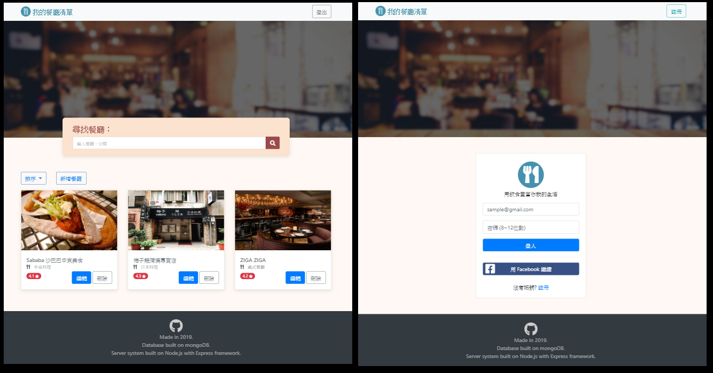

# Restaurant List v2.0 (Node.js + MongoDB)
A restaurant list app. <br>
This is a student project that built on Node.js with Express framework. <br>
Database used mongoDB.

簡易的餐廳清單APP。 <br>
這是一個用 Node.js 架設網站的練習專案。

目前使用 branch 保存不同版本，數字越大者越新。

| 單元 | branch  |
| ----| -------- |
| A9  | master   |
| A10 | refactor |
| A13 | auth     |


#### 練習目標
A9
* 使用 Node.js 連結並操作 NoSQL 資料庫 mongoDB。
* 操作資料庫實作 CRUD。
* 於 Node.js 建立資料庫之 Model，學習 MVC 架構。

A10
* 透過中間件 method-override 製作符合 RESTful 之路由。
* 使用 express.Router() 將路由與 controller 獨立出來。
* 操作 mongoose 排序資料後顯示於頁面。

A13
* 使用 passportjs 實作認證系統
* 認識 cookie & session 機制。
* 依登入與否設定瀏覽、操作權限。
* 認識資安問題，用 bcrypt 演算法保護使用者密碼。
* 實作 OAuth 使用第三方登入。
* 認識環境變數，隱藏開發時 App 相關之敏感資料。

## Preview Pages


#### 功能
A9
* 可以與資料庫互動，完成 CRUD 操作。
    * 創建餐廳
    * 瀏覽所有餐廳
    * 瀏覽餐廳詳細
    * 編輯餐廳資料
    * 刪除餐廳
* 可以透過餐廳名稱或類別進行搜尋。

A10
* 可以用不同的排序顯示所有餐廳。

A13
* 添加認證系統，可註冊/登入/登出。
* 可使用 Facebook 登入。
* 不同帳戶擁有各自獨立的餐廳清單。
* 未登入者，無法進一步使用此 App。

## Usage
此為本機端之練習專案，需下載後安裝依賴套件才可執行。

安裝方法，請參考下方 [Dependency packages](#Dependency-packages) 與 [Installation](#Installation) 項目。 <br>
安裝完成後，使用以下步驟於本機端啟動專案。

1. 切換 branch (請查看頂部關於 branch 的資訊)
    ```
    $ git checkout [branch name]
    ```

1. 於 mongoDB 安裝目錄，啟動 mongoDB。 
    
    * macOS [官方文件](https://docs.mongodb.com/manual/tutorial/install-mongodb-enterprise-on-os-x/#run-mongodb)
    ```
    $ ~/mongodb/bin> mongod --dbpath <path to data directory>
    ```
    
    * windows(需用系統管理員執行) [官方文件](https://docs.mongodb.com/manual/tutorial/install-mongodb-enterprise-on-windows/#start-mdb-edition-as-a-windows-service)
    ```
    $ net start mongodb
    ```

1. 回到專案目錄，執行 seed，用於 mongoDB 建立基本資料 (非必須)
    ```
    $ npm run seed
    ```

    * 執行 seed 後可使用假帳戶進行快速測試
    ```
    // file path: /models/seeds/users.json
    
    {
      "email": "user1@example.com",
      "password": "12345678"
    },
    {
      "email": "user2@example.com",
      "password": "12345678"
    }
    ```


1. 於專案根目錄中新建 .env 檔案，設置環境變數。(Facebook 開發者 App 資訊)
    ```
    FACEBOOK_ID = ***
    FACEBOOK_SECRET = ***
    FACEBOOK_CALLBACK = http://localhost:3000/OAuth/facebook/callback
    ```

1. 啟動 Node.js Server
    
    * 有安裝 nodemon，於專案根目錄執行
    ```
    $ npm run dev
    ```

    * 未安裝 nodemon，於專案根目錄執行
    ```
    $ npm run start
    ```

1. 於瀏覽器開啟網頁
    ```
    http://localhost:3000
    ```

1. 瀏覽完畢後，關閉 Node.js Server
    ```
    回到 cmd 按下 Ctrl + C
    ```

1. 關閉 mongoDB
    * macOS
    ```
    關閉 Terminal 即可
    ```
    
    * windows(需用系統管理員執行)
    ```
    $ net stop mongodb
    ```

## Dependency packages
#### main
* [Node.js](https://nodejs.org/en/) v10.16.3
* [mongoDB](https://www.mongodb.com/) v4.0.12

#### npm package
```
"dependencies": {
    "bcryptjs": "^2.4.3",
    "connect-flash": "^0.1.1",
    "dotenv": "^8.1.0",
    "express": "^4.17.1",
    "express-handlebars": "^3.1.0",
    "express-session": "^1.16.2",
    "method-override": "^3.0.0",
    "mongoose": "^5.6.12",
    "passport": "^0.4.0",
    "passport-facebook": "^3.0.0",
    "passport-local": "^1.0.0"
  }
```

#### other package (imported from CDN)
* [Bootstrap](https://getbootstrap.com/) v4.3.1
  * jQuery v3.4.1
  * popper v1.14.7
* [Font-Awesome](https://fontawesome.com/) v5.10.2


## Installation
這是使用 Node.js 於 localhost 架設的網站。 <br>
必須下載後於本機端執行。

#### Download Project
1. 直接於 Github 上用瀏覽器下載 ZIP file
2. 用 Git clone 專案
```
$ git clone https://github.com/Lastor-Chen/node_restaurant_list_v2.git [資料夾名稱]
```

#### Download Node.js
本機端必須安裝 Node.js 與相關 package 才能執行此專案。 <br>
如尚未安裝 Node.js，建議使用 nvm toolkit 下載指定版本的 Node.js

| install nvm |  |
| -------- | -------- |
| nvm-windows     | [Link to](https://github.com/coreybutler/nvm-windows) |
| nvm-macOS     | [Link to](https://github.com/nvm-sh/nvm) |

#### Download dependency npm packages
已在 package.json 中登入相關訊息，可直接執行下列指令安裝所需套件。
```
$ npm install
```

#### Download mongoDB
本機端必須安裝 mongoDB 才能執行此專案。 <br>
請連結到 mongoDB 官方網站[下載](https://www.mongodb.com/download-center/community)。

※ 注意，Windows 用戶可能會於安裝 GUI Compass 時出問題。建議安裝時不勾選，另行安裝 [Robo 3T](https://robomongo.org/)。

#### 選擇安裝 nodemon
本專案推薦使用 [nodemon](https://github.com/remy/nodemon) 來取代原生的 Node.js 啟動方法。
```
$ npm install -g nodemon
```